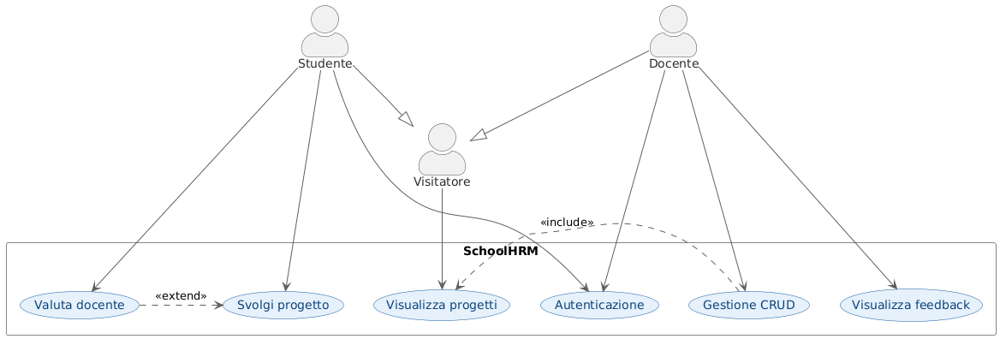
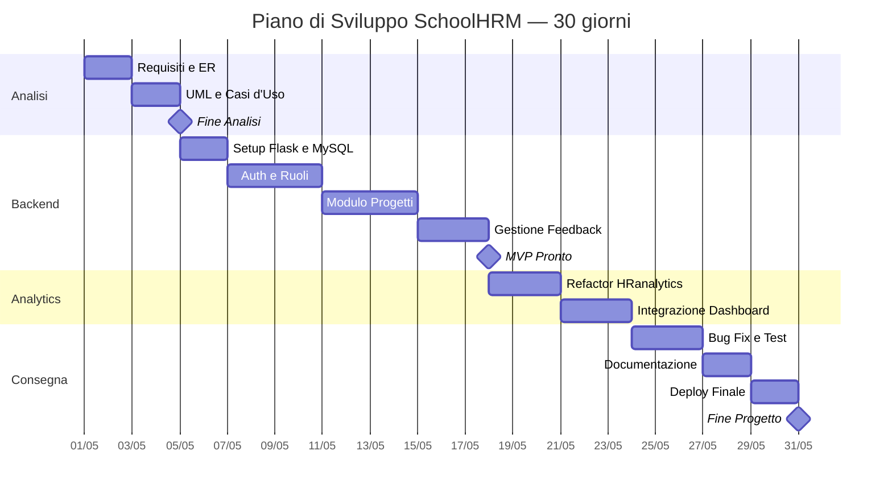

# Documento dei Requisiti — SchoolHRM

> Questo documento descrive i requisiti per il progetto di fine anno del modulo `03_Sviluppo_Web_e_Database`.
> Il tema scelto è **SchoolHRM**, un'applicazione web per la gestione delle attività scolastiche degli studenti, con sistema di feedback verso i docenti.

---

## 1. Introduzione

### 1.1 Scopo del documento

Lo scopo di questo documento è:

- descrivere in modo chiaro il prodotto da realizzare;
- raccogliere i requisiti funzionali e non funzionali del sistema;
- fornire una prima progettazione concettuale tramite casi d'uso e diagrammi;
- definire una roadmap di lavoro con milestone e attività principali.

### 1.2 Contesto

Gli studenti del quinto anno devono realizzare un progetto web con backend in Python/Flask e database relazionale. Il progetto deve prevedere:

- una gestione dati persistente;
- un sistema di autenticazione e sicurezza;
- un'interfaccia web con visualizzazione dinamica tramite Jinja2;
- relazioni tra più tabelle nel database.

### 1.3 Descrizione del progetto

Tema scelto: **SchoolHRM** *(School Human Resource Management)*.

SchoolHRM è un'applicazione web pensata per il contesto scolastico in cui gli studenti possono autenticarsi, partecipare a progetti proposti dai docenti e lasciare valutazioni (stelle e commenti) ai docenti che gestiscono i progetti. I docenti possono creare e gestire i propri progetti tramite operazioni CRUD e consultare i feedback ricevuti.

---

## 2. Obiettivi generali

- Permettere a studenti e docenti di registrarsi e autenticarsi sulla piattaforma.
- Consentire ai docenti di creare, modificare, eliminare e visualizzare i propri progetti.
- Consentire agli studenti di visualizzare i progetti disponibili e svolgerli.
- Permettere agli studenti di valutare i docenti tramite un sistema di stelle e commenti.
- Consentire ai docenti di consultare i feedback ricevuti dagli studenti.
- Garantire che le operazioni sensibili (CRUD, valutazione) siano accessibili solo agli utenti autenticati.

---

## 3. Stakeholder e attori

| Stakeholder            | Ruolo              | Interesse                                                       |
| ---------------------- | ------------------ | --------------------------------------------------------------- |
| Studente sviluppatore  | Sviluppatore       | Realizzare il progetto rispettando i requisiti tecnici          |
| Docente valutatore     | Valutatore         | Verificare la correttezza tecnica e la completezza del progetto |
| Studente utente finale | Attore del sistema | Accedere ai progetti e valutare i docenti                       |
| Docente utente finale  | Attore del sistema | Gestire i propri progetti e consultare i feedback               |

### Attori principali

- `Visitatore` — utente non autenticato, può solo visualizzare i progetti pubblici.
- `Studente` — utente autenticato con ruolo studente; estende `Visitatore`.
- `Docente` — utente autenticato con ruolo docente; estende `Visitatore`.

---

## 4. Requisiti funzionali

### 4.1 Requisiti principali

1. **Autenticazione**: registrazione e login per studenti e docenti con ruoli distinti.
2. **Gestione progetti (CRUD)**: i docenti possono creare, leggere, aggiornare ed eliminare i propri progetti.
3. **Visualizzazione progetti**: tutti gli utenti (anche non autenticati) possono visualizzare l'elenco dei progetti disponibili.
4. **Svolgimento progetti**: gli studenti autenticati possono iscriversi e svolgere i progetti.
5. **Valutazione docenti**: gli studenti autenticati possono lasciare un feedback (stelle 1–5 e testo) ai docenti che gestiscono i progetti.
6. **Visualizzazione feedback**: i docenti autenticati possono consultare i feedback ricevuti dagli studenti.

### 4.2 User stories

- Come **visitatore**, voglio visualizzare l'elenco dei progetti disponibili senza dover fare il login.
- Come **visitatore**, voglio visualizzare la dashboard generale senza dover fare il login.
- Come **studente**, voglio registrarmi e autenticarmi per accedere alle funzionalità della piattaforma.
- Come **studente autenticato**, voglio iscrivermi a un progetto per poterlo svolgere.
- Come **studente autenticato**, voglio valutare un docente con stelle e un commento per condividere la mia esperienza.
- Come **docente**, voglio registrarmi e autenticarmi per gestire i miei progetti.
- Come **docente autenticato**, voglio creare un nuovo progetto per renderlo disponibile agli studenti.
- Come **docente autenticato**, voglio modificare o eliminare un mio progetto per mantenerlo aggiornato.
- Come **docente autenticato**, voglio consultare i feedback ricevuti per migliorare la mia attività.

---

## 5. Requisiti non funzionali

- Le password devono essere protette tramite hashing (`werkzeug.security`).
- Il backend deve usare **MySQL** come database relazionale, condiviso tra la web app Flask e la dashboard HRanalytics.
- Il codice deve essere organizzato con Flask Blueprints e pattern repository.
- Il progetto deve essere eseguibile localmente tramite ambiente virtuale Python.
- I dati devono essere persistenti tra sessioni diverse.
- Il sistema di autenticazione deve distinguere i ruoli `studente` e `docente` con accesso differenziato alle funzionalità.
- La dashboard HRanalytics deve connettersi al database MySQL tramite le stesse credenziali della web app, senza duplicare i dati.
- In produzione, il server WSGI utilizzato sarà **Gunicorn**, l'app verrà deployata su **Render** e il database MySQL sarà ospitato su **Railway** (piano free).

---

## 6. Casi d'uso

### 6.1 Casi d'uso essenziali

| ID   | Nome                         |
| ---- | ---------------------------- |
| UC01 | Registrazione                |
| UC02 | Login                        |
| UC03 | Visualizza progetti          |
| UC04 | Gestione progetti (CRUD)     |
| UC05 | Svolgi progetto              |
| UC06 | Valuta docente               |
| UC07 | Visualizza feedback ricevuti |
| UC08 | Visualizza dashboard         |

### 6.2 Descrizione semplificata dei casi d'uso

- **Registrazione** (`UC01`): il visitatore compila il form con nome, email, password e ruolo (studente o docente); il sistema crea l'account, applica l'hashing alla password e apre la sessione.
- **Login** (`UC02`): l'utente inserisce email e password; il sistema verifica le credenziali e apre la sessione mantenendo il ruolo associato all'account.
- **Visualizza progetti** (`UC03`): qualsiasi utente, anche non autenticato, può visualizzare l'elenco dei progetti disponibili con titolo, descrizione e nome del docente responsabile.
- **Gestione progetti CRUD** (`UC04`): il docente autenticato può creare un nuovo progetto, modificarne i dettagli, eliminarlo o visualizzarne il dettaglio. Questa operazione include sempre `UC03`.
- **Svolgi progetto** (`UC05`): lo studente autenticato si iscrive a un progetto tra quelli disponibili e ne traccia lo svolgimento sulla propria dashboard personale.
- **Valuta docente** (`UC06`): lo studente autenticato assegna una valutazione in stelle (1–5) e un commento testuale al docente responsabile di un progetto. Questa operazione estende `UC05`.
- **Visualizza feedback ricevuti** (`UC07`): il docente autenticato accede a una pagina riepilogativa con tutte le valutazioni ricevute dagli studenti, con media delle stelle e lista dei commenti.
- **Visualizza dashboard** (`UC08`): qualsiasi utente, anche non autenticato, 
  può visualizzare la dashboard pubblica con dati aggregati sui progetti, 
  le valutazioni medie dei docenti e le statistiche di partecipazione.
### 6.3 Relazioni tra casi d'uso: include ed extend

Nel diagramma dei casi d'uso si usano due tipi di relazioni aggiuntive:

- `<<include>>`: comportamento **obbligatorio** — il caso d'uso base lo esegue sempre, ogni volta.
- `<<extend>>`: comportamento **opzionale** — si aggiunge al caso base solo in determinate condizioni.

I rapporti tra attori non vanno confusi con queste relazioni. In SchoolHRM, `Studente` e `Docente` sono specializzazioni di `Visitatore`: ereditano la capacità di visualizzare i progetti e aggiungono azioni specifiche al proprio ruolo. Questo si modella con una **generalizzazione tra attori** (freccia con triangolo cavo), non con `<<include>>` o `<<extend>>`.

**Relazioni `<<include>>`:**

- `UC04 Gestione CRUD` include `UC03 Visualizza progetti`: per gestire un progetto è sempre necessario prima visualizzarlo.

**Relazioni `<<extend>>`:**

- `UC06 Valuta docente` estende `UC05 Svolgi progetto`: la valutazione è un'azione opzionale che lo studente può compiere dopo aver svolto un progetto, non è obbligatoria.

### 6.4 Diagramma dei casi d'uso

## 7. Glossario dei termini

| Termine            | Definizione                                                                                                                        |
| ------------------ | ---------------------------------------------------------------------------------------------------------------------------------- |
| `Progetto`       | Attività didattica creata da un docente, con titolo e descrizione, a cui gli studenti possono iscriversi e partecipare.           |
| `Feedback`       | Valutazione lasciata da uno studente a un docente, composta da un voto in stelle (1–5) e un commento testuale opzionale.          |
| `Stelle`         | Unità di misura della valutazione nel sistema di feedback, su scala da 1 (minimo) a 5 (massimo).                                  |
| `Studente`       | Utente registrato con ruolo studente; può visualizzare e svolgere progetti, e valutare i docenti.                                 |
| `Docente`        | Utente registrato con ruolo docente; può creare e gestire progetti tramite CRUD e consultare i feedback ricevuti.                 |
| `Visitatore`     | Utente non autenticato; può solo visualizzare l'elenco dei progetti pubblici.                                                     |
| `Autenticazione` | Processo di registrazione e login che permette l'accesso alle funzionalità protette della piattaforma.                            |
| `CRUD`           | Acronimo di Create, Read, Update, Delete — le quattro operazioni base sulla gestione dei dati di un progetto.                     |
| `Blueprint`      | Modulo Flask che raggruppa le route, i template e la logica di una specifica area funzionale dell'applicazione.                    |
| `Dashboard`      | Pagina personale dell'utente autenticato che raccoglie le informazioni rilevanti per il suo ruolo (progetti, feedback, analytics). |
| `HRanalytics`    | Repository esterno integrato nel progetto come dashboard analitica, collegato allo stesso database MySQL.                          |

---

## 8. Pianificazione e milestone

Il progetto si articola in cinque fasi principali:

- **Analisi**: definizione dei requisiti, schema ER e diagrammi UML/casi d'uso.
- **Sviluppo Flask**: implementazione dell'app web con Blueprints, templates Jinja2, query SQL e connessione al database MySQL.
- **Integrazione HRanalytics**: rimodellazione del repository HRanalytics per adattarlo allo schema MySQL del progetto e integrazione nella piattaforma.
- **Rifinitura**: test, correzione bug e documentazione.
- **Deploy in produzione**: configurazione Gunicorn, deploy su Render, hosting database su Railway.

| Settimana | Attività                                                                                   |
| --------- | ------------------------------------------------------------------------------------------- |
| 1         | Analisi requisiti, schema ER, diagramma UML, casi d'uso, setup ambiente Flask + MySQL       |
| 2–3      | Sviluppo Flask: Blueprints, templates Jinja2, autenticazione con ruoli, CRUD progetti       |
| 4         | Sviluppo Flask: svolgimento progetti, sistema di feedback, query e connessione DB           |
| 5         | Rimodellazione HRanalytics, adattamento schema MySQL, integrazione dashboard nel progetto   |
| 6         | Test, correzione bug, documentazione, README                                                |
| 7         | Configurazione Gunicorn, deploy su Render, setup database MySQL su Railway, collaudo finale |

### 8.1 Gantt semplificato

### 8.2 Descrizione delle fasi

#### Fase 1 — Analisi *(giorni 1–4)*

Si definiscono i requisiti funzionali e non funzionali del sistema, si produce lo schema ER del database MySQL con tutte le entità (utente, progetto, feedback, iscrizione) e le relative relazioni, e si disegnano il diagramma UML delle classi e il diagramma dei casi d'uso. Si configura anche l'ambiente di sviluppo locale: virtual environment Python, Flask installato, connessione di test al database MySQL.

#### Fase 2 — Backend *(giorni 5–17)*

Si costruisce l'intera applicazione web Flask organizzata in Blueprint distinti per area funzionale (autenticazione, progetti, feedback). Si implementano i template Jinja2 per tutte le pagine (registrazione, login, lista progetti, dettaglio progetto, dashboard docente). Si scrivono le query SQL per tutte le operazioni CRUD, l'autenticazione con gestione dei ruoli studente/docente tramite sessioni Flask, il sistema di iscrizione ai progetti e il modulo di feedback con valutazione a stelle (1–5) e commento testuale.

#### Fase 3 — Analytcs *(giorni 18–23)*

Si prende il repository HRanalytics e si rimodella per farlo lavorare sullo stesso schema MySQL di SchoolHRM invece dei dataset generici originali. Si adattano le query e i modelli di dati della dashboard alle entità del progetto (studenti, docenti, progetti, feedback). La dashboard viene poi integrata come sezione dedicata nell'applicazione Flask, accessibile ai docenti autenticati, mostrando metriche aggregate come andamento delle valutazioni nel tempo, distribuzione dei feedback per progetto e tasso di partecipazione degli studenti.

#### Fase 4 — Consegna *(giorni 24-31)*

Si esegue il testing manuale di tutti i flussi principali (registrazione, login, CRUD progetti, iscrizione, feedback, dashboard analitica). Si correggono i bug emersi, si verifica la sicurezza dei form (protezione CSRF, validazione input lato server), si ottimizzano le query SQL e si completa la documentazione tecnica: README con istruzioni di installazione, struttura del progetto e variabili d'ambiente richieste.
Si configura **Gunicorn** come server WSGI e si prepara il `Procfile` per Render. Il repository GitHub viene collegato a **Render** per il deploy automatico ad ogni `git push` sul branch `main`. Il database MySQL viene creato su **Railway** e le credenziali vengono inserite come variabili d'ambiente su Render (mai hardcodate nel codice). Si esegue un collaudo finale sull'ambiente di produzione verificando tutti i flussi end-to-end prima della consegna.